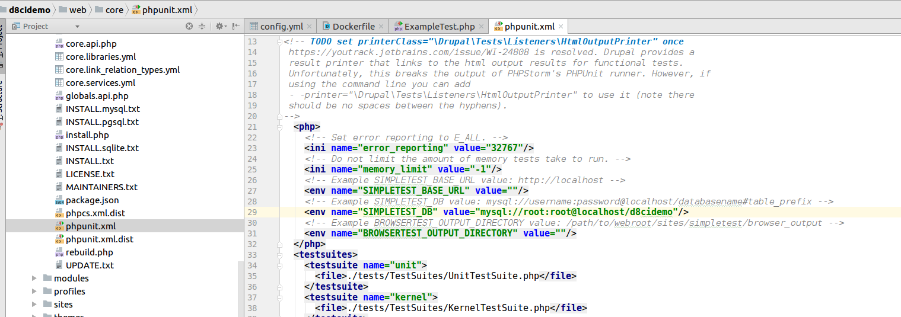

# Drupal 8 testing and CI demo

This is a working demo that integrates CircleCI with a Drupal 8 site using
the installation script from https://github.com/juampynr/drupal8ci.

It contains:

- A demo module with a [unit and kernel test](web/modules/custom/demo_module/tests/src).
- A demo [Behat test](tests).
- CircleCI integration to run the above [on every pull request](https://circleci.com/gh/juampynr/d8cidemo).


If you want to test and individul module and not a whole Drupal site, see
[drupal_tests](https://github.com/deviantintegral/drupal_tests).

## Unit and Kernel tests

Demo https://www.youtube.com/watch?v=Uc3vI8ztsqU

### Setup
1. Run `composer install` from the repository root.
2. Copy `core/phpunit.xml.dist` to `core/phpunit.xml`.
3. Set the `SIMPLETESTDB` environment variable:


4. Run unit and kernel tests in the `modules/custom` directory:
```bash
    cd web
    ../vendor/bin/phpunit -c core --verbose --debug modules/custom
```


## Behat tests

Demo https://www.youtube.com/watch?v=XoxRv8x5ZIs

Full docs at https://behat-drupal-extension.readthedocs.io/en/3.1/localinstall.html

### Setup

#### Install Drupal

Install Drupal as usual. Follow instructions at https://www.drupal.org/docs/8/install.

#### Download Selenium Standalone Server

Open http://www.seleniumhq.org/download and download it to a sub-directory of your home directory.

#### Download Chromedriver

1. Download it from https://sites.google.com/a/chromium.org/chromedriver/downloads into a temporary directory.
2. Place it in a directory listed by the `$PATH` variable. For example, in Ubuntu you could
run `sudo mv /tmp/chromedriver /usr/local/bin`.

#### Start selenium
```bash
[juampy@carboncete ~/Software]$ java -jar selenium-server-standalone-3.6.0.jar
```

#### Install drupalextension
```bash
    cd /path/to/composer.json
    composer require --dev drupal/drupal-extension:master-dev
```

#### Adjust Behat settings file
Open [tests/behat.yml](tests/behat.yml) and check that `base_url` and `drupal_root` are correct.

### Run tests
```bash
    [juampy@carboncete /var/www/drupal/d8cidemo/web (master)]$ ../vendor/bin/behat --verbose -c ../tests/behat.yml
```
 
## CI with CircleCI

Sample job run: https://circleci.com/gh/juampynr/d8cidemo/19

The brains of the CircleCI integration are at the [CircleCI configuration file](.circleci/config.yml), which
orchestrates what should happen when something is pushed to the repository.

`.circleci/config.yml` uses a container for MariaDB, another one for PhantomJS (used for
Behat tests) and a [custom image for setting up the Drupal environment](.circleci/images/primary/Dockerfile).

### Runing the CI jobs locally

Install the CircleCI command line interface at https://circleci.com/docs/2.0/local-jobs/. Then
clone this repository and run the job with `circleci build`.

### Running the CI jobs in CircleCI

Sign up with GitHub at https://circleci.com/signup/ and then allow access to your fork of
this repository. Then either trigger a build manually, push a change or
create a pull request to trigger the build job. Then see the results at
https://circleci.com/dashboard.

## Links
- An overview of testing in Drupal 8
